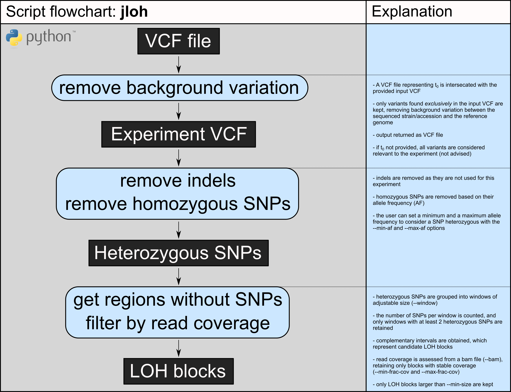

# J LOH

*[Still the one from the block](https://www.youtube.com/watch?v=dly6p4Fu5TE)*

A tool to extract blocks of loss of heterozygosity (LOH) based on single-nucleotide polymorphisms (SNPs) and a reference genome.



## Install

As simple as: `git clone https://github.com/MatteoSchiavinato/jloh.git`
And it's ready to go!

### Dependencies

| Program     | Type        | Version | Links      |
|-------------|-------------|---------|------------|
| Bedtools    | Program     | 2.25    | [source](https://bedtools.readthedocs.io/en/latest/), [cite](https://doi.org/10.1093/bioinformatics/btq033) |
| pysam       | Module      | 0.1.7   | [source](https://pypi.org/project/pysam/), [cite](https://github.com/pysam-developers/pysam) |
| Python      | Interpreter | 3.6.1   | [source](https://www.python.org/downloads/release/python-397/), [cite](http://citebay.com/how-to-cite/python/) |

## Run

The basic usage of the program is as simple as:

```
./jloh --vcf <VCF> --genome-file <GENOME_FILE> [options]
```

To produce a genome file, simply calculate the length of each sequence in your reference FASTA file and produce a file containing their name + length, structured in a tab-separated format that looks like this:

```
chr1  89214414
chr2  1231455
chr3  90804782
...
```

The program has many other options:

```
J LOH
Still the one from the block
-
Extact LOH blocks from SNPs and a reference genome
--------------------------------------------------------------------------------
by Matteo Schiavinato
based on the work of Leszek Pryszcz and Veronica Mixao
DOIs:
Pryszcz et al., 2014	https://doi.org/10.1093/gbe/evu082
Mixao et al., 2019		https://doi.org/10.3389/fgene.2019.00383
--------------------------------------------------------------------------------

Usage:
./jloh --vcf <VCF> --genome-file <GENOME_FILE> [options]

[mandatory]
--vcf               Input VCF file containing all types of variants             [!]
--genome-file       File with chromosome lengths (chromosome <TAB> size)        [!]

[optional]
--sample            Sample name / Strain name for output files                  [loh_blocks]
--output-dir        Output directory                                            [loh_blocks_out]
--window            Window for heterozygous blocks definition                   [100]
--min-size          Min. LOH block size                                         [100]
--block-distances   Comma-sep. list of desired distances between LOH blocks     [100,1000,5000]
--min-af            Min. allele frequency to consider a variant heterozygous    [off]
--max-af            Max. allele frequency to consider a variant heterozygous    [off]
--bam               BAM file (only required when filtering by coverage)         [off]
--min-frac-cov      Min. mean coverage fraction for LOH blocks                  [off]
--max-frac-cov      Max. mean coverage fraction for LOH blocks                  [off]
--bedtools          Path to the bedtools executable                             [bedtools]
--print-info        Show authors and edits with dates                           [off]
```

## Output

The program produces the following output files:

```
Sc_Sk_t1000.d100bp.bed
Sc_Sk_t1000.d100bp.complement.bed
Sc_Sk_t1000.d100bp_provisory.bed
Sc_Sk_t1000.het_snps.vcf
Sc_Sk_t1000.homo.d100bp.bed
Sc_Sk_t1000.homo.d100bp.cov_flt.100bp.bed
Sc_Sk_t1000.homo.d100bp.cov_flt.1000bp.bed
Sc_Sk_t1000.homo.d100bp.cov_flt.5000bp.bed
Sc_Sk_t1000.homo.d100bp.cov_flt.bed
```

Of these, the main output file containing all the detected **LOH blocks** is: `Sc_Sk_t1000.homo.d100bp.cov_flt.bed`

The other *n* files named similarly are subsets of the main output file, with a different minimum distance between LOH blocks (indicated in the filename). For example, the `Sc_Sk_t1000.homo.d100bp.cov_flt.5000bp.bed` file contains only LOH blocks that are at least 5000 bp apart in the genome.

Note that the filenames depend on the parameters declared: using `--window 100` will result in a file called `*.d<winsize>bp.*`, and using `--block-distances` will result in one file per block distance specified (e.g. 100,1000,5000 in this case).

Besides these files, other output files are:

- `Sc_Sk_t1000.het_snps.vcf`: the heterozygous SNPs extracted and used to calculate LOH blocks
- `Sc_Sk_t1000.d100bp_provisory.bed`: the BED file produced from those SNPs, considering windows of `--window` size, indicated in the file name (`*.d<winsize>bp.*`)
- `Sc_Sk_t1000.d100bp.bed`: a merged version of this BED file, where overlapping heterozygous regions are merged together
- `Sc_Sk_t1000.d100bp.complement.bed`: the complement of the merged BED file, obtained with `bedtools complement`
- `Sc_Sk_t1000.homo.d100bp.bed`: candidate homozygous regions in BED format
